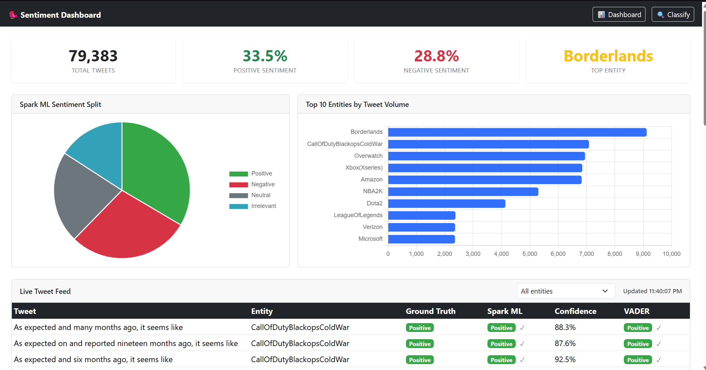
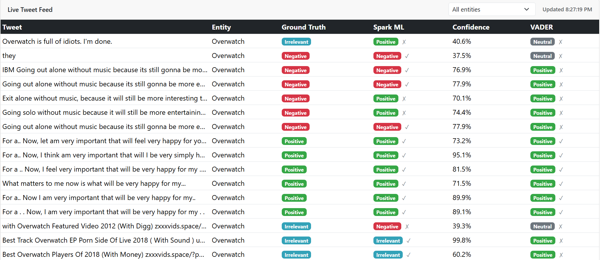
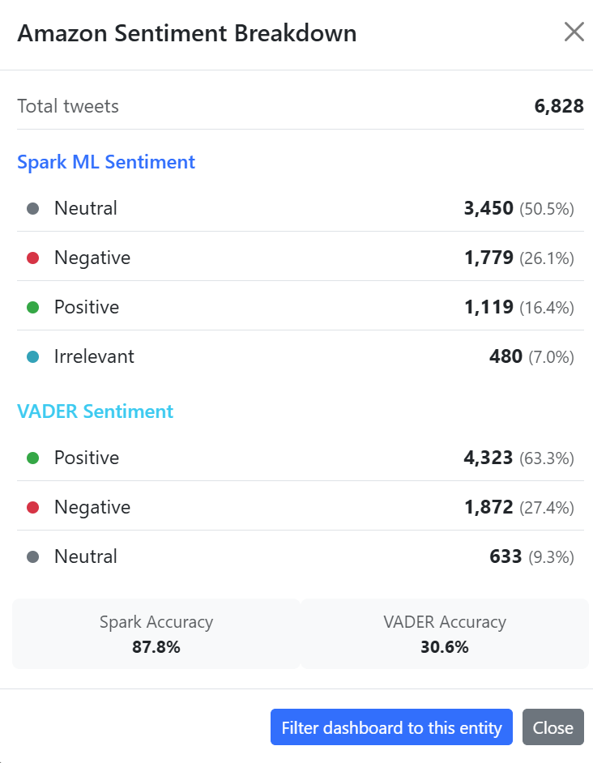
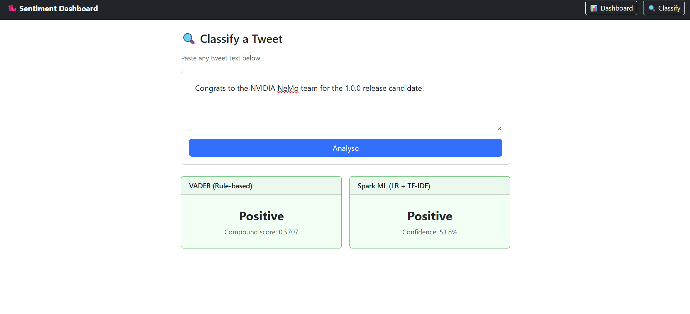

# Real-Time Twitter Sentiment Analysis

A streaming pipeline that reads tweets from a Kafka topic, classifies them using a PySpark ML model and VADER, stores results in MongoDB, and displays everything on a live Django dashboard.

The ML model is a Logistic Regression classifier trained on TF-IDF bigram features across four sentiment classes: Positive, Negative, Neutral, and Irrelevant. The dashboard updates every 5 seconds without any page refresh.


---

## Screenshots

**Live Dashboard**


**Live Tweet Feed with sentiment labels**


**Entity sentiment breakdown (click any bar in the chart)**


**Manual classify tab**


---

## Architecture

```
Twitter CSV
    |
    v
Producer (producer.py)
    |  publishes JSON to Kafka topic "tweets"
    v
Kafka Broker (Docker)
    |
    v
Consumer (consumer.py)
    |  PySpark Structured Streaming
    |  - Spark ML inference (LR + TF-IDF bigrams)
    |  - VADER scoring
    |  - writes results to MongoDB
    v
MongoDB (twitter_sentiment.tweets)
    |
    v
Django Dashboard (127.0.0.1:8000)
    |  - Live tweet table
    |  - Sentiment pie chart
    |  - Top entities bar chart
    |  - Manual classify tab
```

---

## Tech Stack

| Component | Technology |
|---|---|
| Message broker | Apache Kafka + Zookeeper (Docker) |
| Stream processing | PySpark 3.5 Structured Streaming |
| ML model | Logistic Regression with TF-IDF bigrams (Spark MLlib) |
| Rule-based NLP | VADER SentimentIntensityAnalyzer |
| Database | MongoDB |
| Dashboard | Django 5 + Chart.js + Bootstrap 5 |
| Environment | Conda (Python 3.11, OpenJDK 11) |

---

## Project Structure

```
Real-Time-Twitter-Sentiment-Analysis/
├── Django-Dashboard/
│   ├── manage.py
│   ├── dashboard/
│   │   ├── views.py          # API endpoints + Spark inference
│   │   ├── models.py         # MongoDB connection
│   │   ├── templates/        # dashboard.html, classify.html, base.html
│   │   └── static/           # dashboard.js, style.css
│   └── sentimentapp/
│       └── settings.py       # Mongo URI, Spark model path
├── Kafka-PySpark/
│   ├── producer.py           # reads CSV, publishes to Kafka
│   ├── consumer.py           # Spark streaming, writes to MongoDB
│   └── config.py             # shared constants
├── ML-PySpark-Model/
│   ├── datasets/             # twitter_training.csv, twitter_validation.csv
│   └── notebooks/
│       ├── train_model.ipynb # 6-stage pipeline training + evaluation
│       └── data_exploration.ipynb
├── environment.yml
├── requirements.txt
└── zk-single-kafka-single.yml
```

---

## Prerequisites

- Windows 10/11 with [Anaconda](https://www.anaconda.com/)
- [Docker Desktop](https://www.docker.com/products/docker-desktop/)
- [MongoDB Community](https://www.mongodb.com/try/download/community) running on localhost:27017
- Hadoop winutils for Windows: place `winutils.exe` in `C:\hadoop\bin` and set `HADOOP_HOME=C:\hadoop`

---

## Setup

**1. Create the Conda environment**
```bash
conda env create -f environment.yml
conda activate sentiment_env
```

**2. Train the ML model** (one time only, takes 3-5 minutes)

Open `ML-PySpark-Model/notebooks/train_model.ipynb` and run all cells. This saves the trained pipeline to `ML-PySpark-Model/saved_models/spark_lr_pipeline`.

**3. Start Kafka**
```bash
docker-compose -f zk-single-kafka-single.yml up -d
```

---

## Running the Pipeline

Open three separate terminals, all with `conda activate sentiment_env`.

**Terminal 1 - Spark consumer**
```bash
cd Kafka-PySpark
python consumer.py
```

**Terminal 2 - Kafka producer**
```bash
cd Kafka-PySpark
python producer.py
```

**Terminal 3 - Django dashboard**
```bash
cd Django-Dashboard
python manage.py migrate
python manage.py runserver
```

Open http://127.0.0.1:8000 to see the live dashboard.

---

## Classify Tab

The classify tab lets you type any tweet and get instant predictions from both models. VADER responds immediately. Spark ML takes about 30 seconds on the first request (JVM cold start) and is instant after that.

Note: the classify tab uses its own SparkSession. Stop consumer.py before using it, since only one SparkSession can run at a time on a single machine.

---

## Dataset

The project uses the [Twitter Entity Sentiment Analysis](https://www.kaggle.com/datasets/jp797498e/twitter-entity-sentiment-analysis) dataset from Kaggle. Place the CSV files in `ML-PySpark-Model/datasets/` before training.

| File | Rows |
|---|---|
| twitter_training.csv | 73,996 |
| twitter_validation.csv | 1,000 |

Four classes: Positive, Negative, Neutral, Irrelevant.

---

## Model Performance

Validation accuracy after training with TF-IDF bigrams:

| Model | Accuracy |
|---|---|
| Spark ML (LR + TF-IDF bigrams) | ~85% |
| VADER | ~38% |

VADER's lower accuracy is expected as it cannot predict the Irrelevant class, which makes up about 17% of the dataset.
